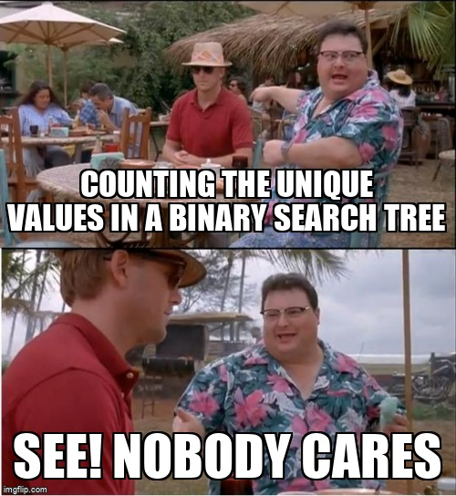

# System Algorithms

Welcome to the **System Algorithms** repository! This project is a deep dive into the world of algorithms designed to solve complex system-level problems. From graph traversal to pathfinding, this repository showcases a variety of algorithms implemented in C, with a focus on performance and scalability.

---

## About the Developer

Hi, I'm Treyvon Turner, a passionate software engineer with a strong interest in algorithms and system design. I enjoy solving challenging problems and sharing my knowledge with the developer community. You can connect with me on [LinkedIn](https://www.linkedin.com/in/TreyvonTurner/) or explore more of my work on my [Portfolio](https://github.com/AfroCircus64).

---

## Project Description

This repository is a collection of system-level algorithms that are essential for solving real-world problems. The project includes implementations of:

- Graph traversal algorithms (e.g., BFS, DFS)
- Pathfinding algorithms (e.g., Dijkstra's, A*)

---

## Development Story

The journey of developing this project was both challenging and rewarding. It started as a simple exercise to implement basic graph traversal algorithms but quickly evolved into a comprehensive exploration of system-level problem-solving techniques. 

One of the most exciting parts of this project was optimizing the algorithms for performance. For example, implementing Dijkstra's algorithm with a priority queue significantly improved its efficiency on large graphs.

---

## Implemented Features

- **Graph Traversal**: Breadth-First Search (BFS) and Depth-First Search (DFS)
- **Pathfinding**: Dijkstra's algorithm and A* algorithm

---

## Features to Be Implemented
- Visualization tools for better understanding of algorithm behavior
- Integration with real-world datasets for testing

---

## Challenges Encountered

1. **Balancing Time and Space Complexity**: Optimizing algorithms to handle large datasets without excessive memory usage was a recurring challenge.
2. **Debugging Complex Logic**: Implementing algorithms like A* required careful debugging to ensure correctness.

---

Thank you for exploring this repository! If you have any questions or suggestions, feel free to reach out.
